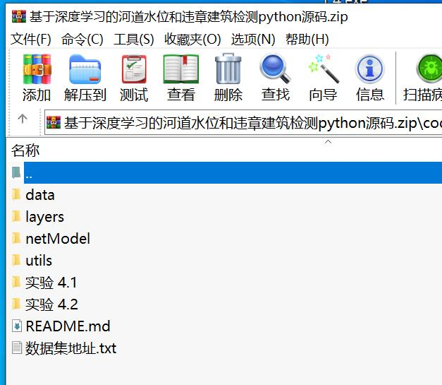

# Based on Deep Learning for River Water Level and Illegal Building Detection in Python Code + Dataset.zip

## Python.zip

This is a Python source code for building a deep learning model to detect water level and illegal buildings in rivers. The source code includes the implementation of Single Shot MultiBox Detector (SSD) using PyTorch.

### Table of Contents

- Installation
- Datasets
- Installation
- Datasets

## Installation

1. Install PyTorch by selecting your environment on the website and running the appropriate command.
2. Clone this repository.
3. Note: We currently only support Python 3+.

## Download Datasets

We now support Visdom for real-time loss visualization during training!

### First, install Python server and client

```bash
pip install visdom
```

### Start the server (probably in a screen or tmux)

```bash
python -m visdom.server
```

Then (during training) navigate to http://localhost:8097/ (see the Train section below for training details).

Note: For training, we currently support VOC and COCO, and aim to add ImageNet support soon.

### Experiment 4.1

Use gauge.zip data to train a water level gauge detection model.

### Experiment 4.2

Use mark.zip data to train a real water level and warning water level detection model.

### Experiment 4.2

Use buildingwater.zip data to train a river area and building area detection model.

## Notes

1. Modify `data/custom.py` to adjust CUSTOM_CLASSES according to different datasets.
2. Modify `data/config.py` to adjust num_classes, lr_steps, max_iter according to different datasets.
## Images



Here is a pay link on Stripe ( https://buy.stripe.com/3cs8yP7sY87d0vu9AB ). Please contact me lonlonago@foxmail.com after funding $89, and I will send you a complete data files , thank you!

